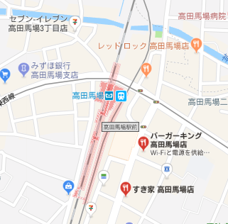
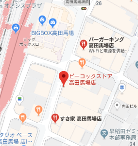

# ideal-plasear

だいたい思考の殴り書き

Ideal:理想
+
place:場所
+
search:検索

イデアルプレイサー

ユーザーが指定した複数の施設を検索し、その施設が全て揃った町を教えてくれるサービス、

及び指定した複数の施設にアクセスしやすい住所を教えてくれるサービス

例
- 座標
  - 東京都
- 距離(半径)
  - 1500

- 施設1
  - 施設種別
    - レストラン
  - 施設名
    - バーガーキング
- 施設2
  - 施設種別
    - レストラン
  - 施設名
    - すき家

- 検索結果
  

- フェーズ1
  - 町名マッチングの完了
    - 高田馬場に住むのがおすすめです
- フェーズ2
  - 地図表示してすき家とバーガーキングの中央の座標を教えてくれる
  - 東京都新宿区高田馬場１丁目２８−７ ヒルサイドパレス
  
  

- 入力項目
  - 座標
    - 仮で都道府県を使用
  - 距離(半径)
  - 施設種別
  - 施設名

- リストアップロジックについて
  - 町名マッチング(ex.東京都豊島区`[池袋]`)
  - 距離マッチング(ex.東京都豊島区池袋と東京都豊島区西池袋で距離が近いもの)
リストアップロジックの条件に当てはまったものが表示される

サービス構成

- フロントエンド
  - Vue
  - vuesax(UI)
  - Netlify

- バックエンド(APIの叩き先)
  - Firebase

- 使用技術
  - Google Maps API
    - Geocoding API
      - 住所から座標を取得するのに使用
    - Places API
      - `NearBy Search`
        - 指定した座標付近の施設を取得するのに使用

# 距離計算フロー

フロー
1. 全店舗取得
2. 全距離計算
3. 近い店のペアをリストアップ
4. 近い店同士の中心の座標(ここはよしなに)を取得
5. 表示

## 実際に表示される畫面イメージ

東京都でサブウェイとすき家と油組が近い場所はここ！！！
東京都豊島区池袋
  店舗一覧
    サブウェイ 池袋店
    すき家 池袋店
    油組 池袋店

サブウェイとすき家が近い場所はここ！！！